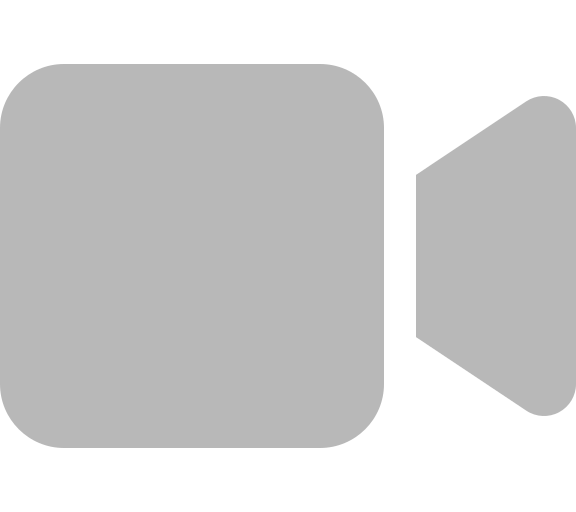

 

   ENGLISH | <a href="https://github.com/zhenglinpan/Awesome-Animation-Research/blob/master/README_CN.md">简体中文</a>

# Awesome Animation Research 🎥📚

This repository provides a curated collection of dataset, research, and resources related to **🎞️cel animation / 🎞️hand-drawn cartoons** specifically. 

💁‍♀️**What You'll Find Here:** Papers/Dataset/Repo closely related to cel animation(cartoon video) that could potentially assist creating animation. e.g. Inbetweening, Genga Colorization. 

🤷‍♀️**What's Not Included:** General Anime Research. i.e. Anime Style Transfer, Anime Image Enhancement, Anime Image generation. If you are interested in general anime research, please refer to [AwesomeAnimeResearch](https://github.com/SerialLain3170/AwesomeAnimeResearch).

****

🙇‍♀️Creating animation is time-consuming and often involves arduour manual work. AI tools are changing this landscape. Researchers are coping with animation-specific challenges like inbetweening and frame-to-frame color propagation. 

Cartoon research is new, niche, interesting, and we look forward to more researchers, including you, contributing to it.

The repo will keep track of the latest research. Feel free to follow and star ! 🌟

## New Papers
<!-- [*new]  -->

🚩【Colorization】**Continual few-shot patch-based learning for anime-style colorization**  &nbsp; | &nbsp;
 &nbsp; \
*Akinobu Maejima, Seitaro Shinagawa, Hiroyuki Kubo, Takuya Funatomi, Tatsuo Yotsukura, Satoshi Nakamura & Yasuhiro Mukaigawa* \
[09 Jul., 2024] [CVM, 2024]

🚩【Dataset】**Anita Dataset: An Industrial Animation Dataset**  &nbsp; | &nbsp;
 &nbsp;
 &nbsp;
 &nbsp; \
*Zhenglin Pan, Yu Zhu* \
[26 Jun., 2024] [Github Repo, 2024]

🚩【Interpolation】 **ToonCrafter: Generative Cartoon Interpolation** &nbsp; | &nbsp;
 &nbsp;
 &nbsp;
 &nbsp; \
*Jinbo Xing, Hanyuan Liu, Menghan Xia, Yong Zhang, Xintao Wang, Ying Shan, Tien-Tsin Wong*\
[29 May., 2024] [arxiv, 2024]

## Datasets

**Anita Dataset: An Industrial Animation Dataset**  &nbsp; | &nbsp;
 &nbsp;
 &nbsp;
 &nbsp; \
*Zhenglin Pan, Yu Zhu* \
[26 Jun., 2024] [Github Repo, 2024]

**Sakuga-42M Dataset: Scaling Up Cartoon Research**  &nbsp; | &nbsp;
 &nbsp;
 &nbsp;
 &nbsp;
 &nbsp; \
*Zhenglin Pan, Yu Zhu, Yuxuan Mu* \
[13 May., 2024] [arXiv, 2024]

**AnimeRun: 2D Animation Visual Correspondence from Open Source 3D Movies** &nbsp; | &nbsp;
 &nbsp;
 &nbsp;
 &nbsp;
 &nbsp;
 &nbsp;\
*Li Siyao, Yuhang Li, Bo Li, Chao Dong, Ziwei Liu, Chen Change Loy* \
[10 Nov., 2022] [NeurIPS, 2022]

## Colorization

**Continual few-shot patch-based learning for anime-style colorization**  &nbsp; | &nbsp;
 &nbsp; \
*Akinobu Maejima, Seitaro Shinagawa, Hiroyuki Kubo, Takuya Funatomi, Tatsuo Yotsukura, Satoshi Nakamura & Yasuhiro Mukaigawa* \
[09 Jul., 2024] [CVM, 2024]

**Learning Inclusion Matching for Animation Paint Bucket Colorization**  &nbsp; | &nbsp;
 &nbsp;
 &nbsp;
 &nbsp;
 &nbsp;
 &nbsp;\
*Yuekun Dai, Shangchen Zhou, Qinyue Li, Chongyi Li, Chen Change Loy*\
[2024] [CVPR, 2024]

**Coloring anime line art videos with transformation region enhancement network** &nbsp; | &nbsp;
 &nbsp; \
*Ning Wang, Muyao Niu, Zhi Dou, Zhihui Wang, Zhiyong Wang, Zhaoyan Ming, Bin Liu, Haojie Li*\
[Sep., 2023] [Elsevier, 2023] 

**SketchBetween: Video-to-Video Synthesis for Sprite Animation via Sketches** &nbsp; | &nbsp;
 &nbsp;
 &nbsp;\
*Dagmar Lukka Loftsdóttir, Matthew Guzdial*\
[1 Sep., 2022] [ECCV, 2022] 

**Animation Line Art Colorization Based on Optical Flow Method** &nbsp; | &nbsp;
 &nbsp;\
*Yifeng Yu, Jiangbo Qian, Chong Wang, Yihong Dong, Baisong Liu*\
[27 Aug., 2022] [SSNR, 2022] 

**The Animation Transformer: Visual Correspondence via Segment Matching** &nbsp; | &nbsp;
 &nbsp;
 &nbsp;\
*Evan Casey, Víctor Pérez, Zhuoru Li, Harry Teitelman, Nick Boyajian, Tim Pulver, Mike Manh, William Grisaitis*\
[6 Sep., 2021] [arXiv, 2021]

**Artist-Guided Semiautomatic Animation Colorization** &nbsp; | &nbsp;
 &nbsp;\
*Harrish Thasarathan, Mehran Ebrahimi* \
[22 Jun., 2020] [arXiv, 2020]

**Line Art Correlation Matching Feature Transfer Network for Automatic Animation Colorization** &nbsp; | &nbsp;
 &nbsp;\
*Zhang Qian, Wang Bo, Wen Wei, Li Hai, Liu Jun Hui* \
[14 Apr., 2020] [arXiv, 2020]

**Deep Line Art Video Colorization with a Few References** &nbsp; | &nbsp;
 &nbsp; \
*Min Shi, Jia-Qi Zhang, Shu-Yu Chen, Lin Gao, Yu-Kun Lai, Fang-Lue Zhang* \
[24 Mar., 2020] [arXiv, 2020]

**Automatic Temporally Coherent Video Colorization** &nbsp; | &nbsp;
 &nbsp;
 &nbsp;\
*Harrish Thasarathan, Kamyar Nazeri, Mehran Ebrahimi*

## Inbetweening & Interpolation

**ToonCrafter: Generative Cartoon Interpolation** &nbsp; | &nbsp;
 &nbsp;
 &nbsp;
 &nbsp; \
*Jinbo Xing, Hanyuan Liu, Menghan Xia, Yong Zhang, Xintao Wang, Ying Shan, Tien-Tsin Wong*\
[29 May., 2024] [arxiv, 2024]

**Joint Stroke Tracing and Correspondence for 2D Animation** &nbsp; | &nbsp;
 &nbsp;
 &nbsp;
 &nbsp;\
*Haoran Mo, Chengying Gao, Ruomei Wang*\
[9 Apr., 2024] [SIGGRAPH, 2024]

**Deep Geometrized Cartoon Line Inbetweening** &nbsp; | &nbsp;
 &nbsp;
 &nbsp;
 &nbsp;
 &nbsp;\
*Li Siyao, Tianpei Gu, Weiye Xiao, Henghui Ding, Ziwei Liu, Chen Change Loy*\
[Nov., 2023] [ICCV 2023]

**Exploring inbetween charts with trajectory-guided sliders for cutout animation** &nbsp; | &nbsp;
 &nbsp;\
*T Fukusato, A Maejima, T Igarashi, T Yotsukura*\
[1 Sep., 2023] [MTA 2023]

**Enhanced Deep Animation Video Interpolation** &nbsp; | &nbsp;
 &nbsp;\
*Wang Shen, Cheng Ming, Wenbo Bao, Guangtao Zhai, Li Chen, Zhiyong Gao*\
[25 Jun., 2022] [arXiv, 2022]

**Improving the Perceptual Quality of 2D Animation Interpolation** &nbsp; | &nbsp;
 &nbsp;\
*Shuhong Chen, Matthias Zwicker*\
[24 Nov., 2021] [arXiv, 2021] 

**Deep Animation Video Interpolation in the Wild** &nbsp; | &nbsp;
 &nbsp;
 &nbsp;
 &nbsp;\
*Li Siyao, Shiyu Zhao, Weijiang Yu, Wenxiu Sun, Dimitris N. Metaxas, Chen Change Loy, Ziwei Liu*\
[6 Apr., 2021] [arXiv, 2021] 

**Deep Sketch-guided Cartoon Video Inbetweening** &nbsp; | &nbsp;
 &nbsp;\
*Xiaoyu Li, Bo Zhang, Jing Liao, Pedro V. Sander*\
[10 Aug., 2020] [arXiv, 2020]

**Optical Flow Based Line Drawing Frame Interpolation Using Distance Transform to Support Inbetweenings** &nbsp; | &nbsp;
 &nbsp;\
*Rei Narita, Keigo Hirakawa, Kiyoharu Aizawa*\
[26 Aug., 2019] [IEEE, 2019]

**DiLight: Digital light table – Inbetweening for 2D animations using guidelines** &nbsp; | &nbsp;
 &nbsp;\
*Leonardo Carvalho, Ricardo Marroquim, Emilio Vital Brazil*\
[Jun., 2017] [Elsevier, 2017]

## Editing

**Re:Draw -- Context Aware Translation as a Controllable Method for Artistic Production** &nbsp; | &nbsp;
 &nbsp;\
*Joao Liborio Cardoso, Francesco Banterle, Paolo Cignoni, Michael Wimmer*\
[Jan., 2024] [*TBA 2024]

**Sprite-from-Sprite: Cartoon Animation Decomposition with Self-supervised Sprite Estimation** &nbsp; | &nbsp;
 &nbsp;
 &nbsp;\
*Lvmin Zhang, Tien-Tsin Wong, Yuxin Liu*\
[Nov., 2022] [ACM 2022] 

**Toonsynth: example-based synthesis of hand-colored cartoon animations** &nbsp; | &nbsp;
 &nbsp;\
*M Dvorožnák, W Li, VG Kim, D Sýkora*\
[Jul., 2018] [TOG 2018]

## Tracking & Matching

**Globally Optimal Toon Tracking** &nbsp; | &nbsp;
 &nbsp;\
*Haichao Zhu, Xueting Liu, Tien-Tsin Wong, Pheng-Ann Heng* \
[11 Jul., 2016] [TOG, 2016]

## Segmentation

**Stereoscopizing Cel Animations** &nbsp; | &nbsp;
 &nbsp;\
*Xueting Liu, Xiangyu Mao, Xuan Yang, Linling Zhang, Tien-Tsin Wong* \
[11 Jul., 2016] [ACM, 2013]

## 3D Rotoscoping&Assistance

**Toon3D: Seeing Cartoons from a New Perspective** &nbsp; | &nbsp;
 &nbsp;
 &nbsp;
 &nbsp;
 &nbsp;
[🤗](https://huggingface.co/spaces/ethanweber/toon3d) &nbsp;\
*Ethan Weber, Riley Peterlinz, Rohan Mathur, Frederik Warburg, Alexei A. Efros, Angjoo Kanazawa* \
[2024] [Arxiv, 2024]

## How to Contribute
We encourage animation enthusiasts, researchers, and scholars to contribute to this repository by adding relevant papers, articles, and resources. Your contributions will help build a valuable reference for anyone interested in the art and science of animation.

To contribute, simply fork this repository, make your additions or improvements, and submit a pull request. Please follow the contribution guidelines outlined in the repository's README file.

---

    <em>May Animation Get Better With Us.</em>

   

<i>icon by Twitter</i>©illufinch

