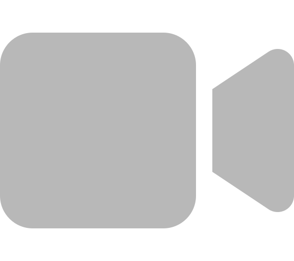

 

   <a href="https://github.com/zhenglinpan/Awesome-Animation-Research/blob/master/README.md">ENGLISH</a> | 简体中文

# Awesome Animation Research 🎥📚

本repo收集了一批关于**🎞️赛璐珞动画/🎞️卡通动画**的各种研究、数据集及其相关资源。

💁‍♀️**在这里你可以找到:** 有可能帮助到动画业界的技术论文、数据集、repo等。例如：中割生成、原画上色等。

🤷‍♀️**这个repo不包括:** 广义的Anime研究。例如：动漫风格滤镜、动漫图像超分、动漫人物生成等。如果你对广义的Anime研究感兴趣，请移步[AwesomeAnimeResearch](https://github.com/SerialLain3170/AwesomeAnimeResearch).

****

🙇‍♀️赛璐珞动画制作非常不易、需要大量动画人一帧帧地手绘，这会花费大量的时间和精力。计算机视觉技术也许正在改变这一现状，有不少的研究者正在尝试利用这一技术辅助动画制作中的某些环节，例如自动中割、自动上色等。

目前这个repo列表目前还很短，因为动画的计算机视觉研究是一个相对新兴且小众的领域，我们期待更多的研究者（也包括你）一起为这个领域的发展做出贡献。

本repo会持续关注最新的研究成果，欢迎关注! 🌟

## 新文章
<!-- [*new]  -->

🚩【数据集】**OregairuChar: A Benchmark Dataset for Character Appearance Frequency Analysis in My Teen Romantic Comedy SNAFU**  &nbsp; | &nbsp;
 &nbsp; \
*Qi Sun, Dingju Zhou, Lina Zhang* \
[Nov., 2025] [arXiv, 2025]

🚩【上色】**DACoN: DINO for Anime Paint Bucket Colorization with Any Number of Reference Images** &nbsp; | &nbsp; 
 &nbsp; 
 &nbsp; \
*Kazuma Nagata, Naoshi Kaneko*\
[Sep., 2025] [arXiv 2025]

🚩【生成】**ToonComposer: Streamlining Cartoon Production with Generative Post-Keyframing** &nbsp; | &nbsp; 
 &nbsp; 
 &nbsp; 
 &nbsp; 
[🤗](https://huggingface.co/spaces/TencentARC/ToonComposer) &nbsp;\
*Lingen Li, Guangzhi Wang, Zhaoyang Zhang, Yaowei Li, Xiaoyu Li, Qi Dou, Jinwei Gu, Tianfan Xue, Ying Shan*\
[Aug., 2025] [arXiv 2025]

## 综述

**Generative AI for Cel-Animation: A Survey** &nbsp; | &nbsp; 
 &nbsp;
 &nbsp;\
*Yunlong Tang, Junjia Guo, Pinxin Liu, Zhiyuan Wang, Hang Hua, Jia-Xing Zhong, Yunzhong Xiao, Chao Huang, Luchuan Song, Susan Liang, Yizhi Song, Liu He, Jing Bi, Mingqian Feng, Xinyang Li, Zeliang Zhang, Chenliang Xu*\
[Jan., 2025] [arXiv 2025]

## 数据集

**OregairuChar: A Benchmark Dataset for Character Appearance Frequency Analysis in My Teen Romantic Comedy SNAFU**  &nbsp; | &nbsp;
 &nbsp; \
*Qi Sun, Dingju Zhou, Lina Zhang* \
[Nov., 2025] [arXiv, 2025]

**MagicAnime: A Hierarchically Annotated, Multimodal and Multitasking Dataset with Benchmarks for Cartoon Animation Generation** &nbsp; | &nbsp; 
 &nbsp; \
*Shuolin Xu, Bingyuan Wang, Zeyu Cai, Fangteng Fu, Yue Ma, Tongyi Lee, Hongchuan Yu, Zeyu Wang*\
[Jul., 2025] [arXiv 2025]

**Anita Dataset: An Industrial Animation Dataset**  &nbsp; | &nbsp;
 &nbsp;
 &nbsp;
 &nbsp; \
*Zhenglin Pan, Yu Zhu* \
[26 Jun., 2024] [Github Repo, 2024]

**Sakuga-42M Dataset: Scaling Up Cartoon Research**  &nbsp; | &nbsp;
 &nbsp;
 &nbsp;
 &nbsp;
 &nbsp; \
*Zhenglin Pan, Yu Zhu, Yuxuan Mu* \
[13 May., 2024] [arXiv, 2024]

**AnimeRun: 2D Animation Visual Correspondence from Open Source 3D Movies** &nbsp; | &nbsp;
 &nbsp;
 &nbsp;
 &nbsp;
 &nbsp;
 &nbsp;\
*Li Siyao, Yuhang Li, Bo Li, Chao Dong, Ziwei Liu, Chen Change Loy* \
[10 Nov., 2022] [NeurIPS, 2022]

## 生成

**ToonComposer: Streamlining Cartoon Production with Generative Post-Keyframing** &nbsp; | &nbsp; 
 &nbsp; 
 &nbsp; 
 &nbsp; 
[🤗](https://huggingface.co/spaces/TencentARC/ToonComposer) &nbsp;\
*Lingen Li, Guangzhi Wang, Zhaoyang Zhang, Yaowei Li, Xiaoyu Li, Qi Dou, Jinwei Gu, Tianfan Xue, Ying Shan*\
[Aug., 2025] [arXiv 2025]

**LongAnimation: Long Animation Generation with Dynamic Global-Local Memory** &nbsp; | &nbsp; 
 &nbsp; 
 &nbsp; 
 &nbsp; \
*Nan Chen, Mengqi Huang, Yihao Meng, Zhendong Mao*\
[Jul., 2025] [arXiv 2025]

**FairyGen: Storied Cartoon Video from a Single Child-Drawn Character** &nbsp; | &nbsp; 
 &nbsp; 
 &nbsp; 
 &nbsp; \
*Jiayi Zheng, Xiaodong Cun*\
[Jun., 2025] [arXiv 2025]

**Aligning Anime Video Generation with Human Feedback** &nbsp; | &nbsp; 
 &nbsp; \
*Bingwen Zhu, Yudong Jiang, Baohan Xu, Siqian Yang, Mingyu Yin, Yidi Wu, Huyang Sun, Zuxuan Wu*\
[Apr., 2025] [arXiv 2025]

**PhysAnimator: Physics-Guided Generative Cartoon Animation** &nbsp; | &nbsp; 
 &nbsp; \
*Tianyi Xie, Yiwei Zhao, Ying Jiang, Chenfanfu Jiang*\
[Jan., 2025] [arXiv 2025]

**LayerAnimate: Layer-specific Control for Animation** &nbsp; | &nbsp; 
 &nbsp;
 &nbsp;
 &nbsp;\
*Yuxue Yang, Lue Fan, Zuzen Lin, Feng Wang, Zhaoxiang Zhang*\
[Jan., 2025] [arXiv 2025]

**AniSora: Exploring the Frontiers of Animation Video Generation in the Sora Era** &nbsp; | &nbsp; 
 &nbsp;
 &nbsp; \
*Yudong Jiang, Baohan Xu, Siqian Yang, Mingyu Yin, Jing Liu, Chao Xu, Siqi Wang, Yidi Wu, Bingwen Zhu, Qi Sen, Xingyu Zheng, Jixuan Xu, Yue Zhang, Jinlong Hou, Huyang Sun*\
[Dec., 2024] [arXiv 2024]

**MikuDance: Animating Character Art with Mixed Motion Dynamics** &nbsp; | &nbsp;
 &nbsp;
 &nbsp;  \
*Jiaxu Zhang, Xianfang Zeng, Xin Chen, Wei Zuo, Gang Yu, Zhigang Tu*\
[Nov.,2024] [arXiv, 2024]

## 分镜

**Story2Board: A Training-Free Approach for Expressive Storyboard Generation** &nbsp; | &nbsp; 
 &nbsp; 
 &nbsp;  
 &nbsp;  \
*David Dinkevich, Matan Levy, Omri Avrahami, Dvir Samuel, Dani Lischinski*\
[Aug., 2025] [arXiv 2025]

**Lay2Story: Extending Diffusion Transformers for Layout-Togglable Story Generation** &nbsp; | &nbsp; 
 &nbsp; \
*Ao Ma, Jiasong Feng, Ke Cao, Jing Wang, Yun Wang, Quanwei Zhang, Zhanjie Zhang*\
[Aug., 2025] [arXiv 2025]

## 上色

**DACoN: DINO for Anime Paint Bucket Colorization with Any Number of Reference Images** &nbsp; | &nbsp; 
 &nbsp; 
 &nbsp; \
*Kazuma Nagata, Naoshi Kaneko*\
[Sep., 2025] [arXiv 2025]

**AnimeColor: Reference-based Animation Colorization with Diffusion Transformers** &nbsp; | &nbsp; 
 &nbsp; 
 &nbsp;  \
*Yuhong Zhang, Liyao Wang, Han Wang, Danni Wu, Zuzeng Lin, Feng Wang, Li Song*\
[Jul., 2025] [arXiv 2025]

**SketchColour: Channel Concat Guided DiT-based Sketch-to-Colour Pipeline for 2D Animation** &nbsp; | &nbsp; 
 &nbsp; 
 &nbsp; 
 &nbsp; \
*Bryan Constantine Sadihin, Michael Hua Wang, Shei Pern Chua, Hang Su*\
[Jul., 2025] [arXiv 2025]

**Animation Anycolor: Enhancing Line Drawing Colorization with Keypoint Matching** &nbsp; | &nbsp; 
 &nbsp; \
*Liyao Wang; Zuzeng Lin; Danni Wu; Zihao Yu; Suzhe Zhang; Zixian Wu*\
[Mar., 2025] [ICASSP 2025]

**Image Referenced Sketch Colorization Based on Animation Creation Workflow** &nbsp; | &nbsp; 
 &nbsp;
 &nbsp;  \
*Dingkun Yan, Xinrui Wang, Zhuoru Li, Suguru Saito, Yusuke Iwasawa, Yutaka Matsuo, Jiaxian Guo*\
[Feb., 2025] [arXiv 2025]

**AniDoc: Animation Creation Made Easier** &nbsp; | &nbsp; 
 &nbsp;
 &nbsp;
 &nbsp;\
*Yihao Meng, Hao Ouyang, Hanlin Wang, Qiuyu Wang, Wen Wang, Ka Leong Cheng, Zhiheng Liu, Yujun Shen, Huamin Qu*\
[Dec., 2024] [arXiv 2024]

**Paint Bucket Colorization Using Anime Character Color Design Sheets** &nbsp; | &nbsp;
 &nbsp;
 &nbsp;
 &nbsp;  \
*Yuekun Dai, Qinyue Li, Shangchen Zhou, Yihang Luo, Chongyi Li, Chen Change Loy*\
[Oct.,2024] [arXiv, 2024]

**LVCD: Reference-based Lineart Video Colorization with Diffusion Models**  &nbsp; | &nbsp;
 &nbsp; 
 &nbsp; \
*Zhitong Huang, Mohan Zhang, Jing Liao* \
[19 Sep. 2024] [arXiv, 2024]

**Continual few-shot patch-based learning for anime-style colorization**  &nbsp; | &nbsp;
 &nbsp; \
*Akinobu Maejima, Seitaro Shinagawa, Hiroyuki Kubo, Takuya Funatomi, Tatsuo Yotsukura, Satoshi Nakamura & Yasuhiro Mukaigawa* \
[09 Jul., 2024] [CVM, 2024]

**Learning Inclusion Matching for Animation Paint Bucket Colorization**  &nbsp; | &nbsp;
 &nbsp;
 &nbsp;
 &nbsp;
 &nbsp;
 &nbsp;\
*Yuekun Dai, Shangchen Zhou, Qinyue Li, Chongyi Li, Chen Change Loy*\
[2024] [CVPR, 2024]

**Coloring anime line art videos with transformation region enhancement network** &nbsp; | &nbsp;
 &nbsp; \
*Ning Wang, Muyao Niu, Zhi Dou, Zhihui Wang, Zhiyong Wang, Zhaoyan Ming, Bin Liu, Haojie Li*\
[Sep., 2023] [Elsevier, 2023] 

**SketchBetween: Video-to-Video Synthesis for Sprite Animation via Sketches** &nbsp; | &nbsp;
 &nbsp;
 &nbsp;\
*Dagmar Lukka Loftsdóttir, Matthew Guzdial*\
[1 Sep., 2022] [ECCV, 2022] 

**Animation Line Art Colorization Based on Optical Flow Method** &nbsp; | &nbsp;
 &nbsp;\
*Yifeng Yu, Jiangbo Qian, Chong Wang, Yihong Dong, Baisong Liu*\
[27 Aug., 2022] [SSNR, 2022] 

**The Animation Transformer: Visual Correspondence via Segment Matching** &nbsp; | &nbsp;
 &nbsp;
 &nbsp;\
*Evan Casey, Víctor Pérez, Zhuoru Li, Harry Teitelman, Nick Boyajian, Tim Pulver, Mike Manh, William Grisaitis*\
[6 Sep., 2021] [arXiv, 2021]

**Artist-Guided Semiautomatic Animation Colorization** &nbsp; | &nbsp;
 &nbsp;\
*Harrish Thasarathan, Mehran Ebrahimi* \
[22 Jun., 2020] [arXiv, 2020]

**Line Art Correlation Matching Feature Transfer Network for Automatic Animation Colorization** &nbsp; | &nbsp;
 &nbsp;\
*Zhang Qian, Wang Bo, Wen Wei, Li Hai, Liu Jun Hui* \
[14 Apr., 2020] [arXiv, 2020]

**Deep Line Art Video Colorization with a Few References** &nbsp; | &nbsp;
 &nbsp; \
*Min Shi, Jia-Qi Zhang, Shu-Yu Chen, Lin Gao, Yu-Kun Lai, Fang-Lue Zhang* \
[24 Mar., 2020] [arXiv, 2020]

**Automatic Temporally Coherent Video Colorization** &nbsp; | &nbsp;
 &nbsp;
 &nbsp;\
*Harrish Thasarathan, Kamyar Nazeri, Mehran Ebrahimi*

## 中割/补帧

**Skeleton-Driven Inbetweening of Bitmap Character Drawings** &nbsp; | &nbsp;
 &nbsp;
 &nbsp;  \
*Kirill Brodt, Mikhail Bessmeltsev*\
[2024] [SIGGRAPH ASIA, 2024]

**Bridging the Gap: Sketch-Aware Interpolation Network for High-Quality Animation Sketch Inbetweening** &nbsp; | &nbsp; \
 &nbsp;
 &nbsp;
 &nbsp;\
*Jiaming Shen, Kun Hu, Wei Bao, Chang Wen Chen, Zhiyong Wang*\
[Aug., 2024] [ACMMM 2024]

**Thin-Plate Spline-based Interpolation for Animation Line Inbetweening** &nbsp; | &nbsp;
 &nbsp;
 &nbsp; \
*Tianyi Zhu, Wei Shang, Dongwei Ren, Wangmeng Zuo*\
[17 Aug., 2024] [arXiv, 2024]

**ToonCrafter: Generative Cartoon Interpolation** &nbsp; | &nbsp;
 &nbsp;
 &nbsp;
 &nbsp; \
*Jinbo Xing, Hanyuan Liu, Menghan Xia, Yong Zhang, Xintao Wang, Ying Shan, Tien-Tsin Wong*\
[29 May., 2024] [arxiv, 2024]

**Joint Stroke Tracing and Correspondence for 2D Animation** &nbsp; | &nbsp;
 &nbsp;
 &nbsp;
 &nbsp;\
*Haoran Mo, Chengying Gao, Ruomei Wang*\
[9 Apr., 2024] [SIGGRAPH, 2024]

**Deep Geometrized Cartoon Line Inbetweening** &nbsp; | &nbsp;
 &nbsp;
 &nbsp;
 &nbsp;
 &nbsp;\
*Li Siyao, Tianpei Gu, Weiye Xiao, Henghui Ding, Ziwei Liu, Chen Change Loy*\
[Nov., 2023] [ICCV 2023]

**Exploring inbetween charts with trajectory-guided sliders for cutout animation** &nbsp; | &nbsp;
 &nbsp;\
*T Fukusato, A Maejima, T Igarashi, T Yotsukura*\
[1 Sep., 2023] [MTA 2023]

**Enhanced Deep Animation Video Interpolation** &nbsp; | &nbsp;
 &nbsp;\
*Wang Shen, Cheng Ming, Wenbo Bao, Guangtao Zhai, Li Chen, Zhiyong Gao*\
[25 Jun., 2022] [arXiv, 2022]

**Improving the Perceptual Quality of 2D Animation Interpolation** &nbsp; | &nbsp;
 &nbsp;\
*Shuhong Chen, Matthias Zwicker*\
[24 Nov., 2021] [arXiv, 2021] 

**Deep Animation Video Interpolation in the Wild** &nbsp; | &nbsp;
 &nbsp;
 &nbsp;
 &nbsp;\
*Li Siyao, Shiyu Zhao, Weijiang Yu, Wenxiu Sun, Dimitris N. Metaxas, Chen Change Loy, Ziwei Liu*\
[6 Apr., 2021] [arXiv, 2021] 

**Deep Sketch-guided Cartoon Video Inbetweening** &nbsp; | &nbsp;
 &nbsp;\
*Xiaoyu Li, Bo Zhang, Jing Liao, Pedro V. Sander*\
[10 Aug., 2020] [arXiv, 2020]

**Optical Flow Based Line Drawing Frame Interpolation Using Distance Transform to Support Inbetweenings** &nbsp; | &nbsp;
 &nbsp;\
*Rei Narita, Keigo Hirakawa, Kiyoharu Aizawa*\
[26 Aug., 2019] [IEEE, 2019]

**DiLight: Digital light table – Inbetweening for 2D animations using guidelines** &nbsp; | &nbsp;
 &nbsp;\
*Leonardo Carvalho, Ricardo Marroquim, Emilio Vital Brazil*\
[Jun., 2017] [Elsevier, 2017]

## 编辑

**Re:Draw -- Context Aware Translation as a Controllable Method for Artistic Production** &nbsp; | &nbsp;
 &nbsp;\
*Joao Liborio Cardoso, Francesco Banterle, Paolo Cignoni, Michael Wimmer*\
[Jan., 2024] [*TBA 2024]

**Sprite-from-Sprite: Cartoon Animation Decomposition with Self-supervised Sprite Estimation** &nbsp; | &nbsp;
 &nbsp;
 &nbsp;\
*Lvmin Zhang, Tien-Tsin Wong, Yuxin Liu*\
[Nov., 2022] [ACM 2022] 

**Toonsynth: example-based synthesis of hand-colored cartoon animations** &nbsp; | &nbsp;
 &nbsp;\
*M Dvorožnák, W Li, VG Kim, D Sýkora*\
[Jul., 2018] [TOG 2018]

## 跟踪/匹配

**Globally Optimal Toon Tracking** &nbsp; | &nbsp;
 &nbsp;\
*Haichao Zhu, Xueting Liu, Tien-Tsin Wong, Pheng-Ann Heng* \
[11 Jul., 2016] [TOG, 2016]

## 分割

**Fast Leak-Resistant Segmentation for Anime Line Art** &nbsp; | &nbsp;
 &nbsp;  \
*Benjamin Allen, Akinobu Maejima, Ken Anjyo*\
[Nov.,2024] [SIGGRAPH, 2024]

**Stereoscopizing Cel Animations** &nbsp; | &nbsp;
 &nbsp;\
*Xueting Liu, Xiangyu Mao, Xuan Yang, Linling Zhang, Tien-Tsin Wong* \
[11 Jul., 2016] [ACM, 2013]

## 3D/转描/3D辅助

**CharacterShot: Controllable and Consistent 4D Character Animation** &nbsp; | &nbsp; 
 &nbsp; 
 &nbsp; \
*Junyao Gao, Jiaxing Li, Wenran Liu, Yanhong Zeng, Fei Shen, Kai Chen, Yanan Sun, Cairong Zhao*\
[Aug., 2025] [arXiv 2025]

**StdGEN: Semantic-Decomposed 3D Character Generation from Single Images** &nbsp; | &nbsp; 
 &nbsp; 
 &nbsp; 
 &nbsp; 
[🤗](https://huggingface.co/spaces/ethanweber/toon3d) &nbsp;\
*Yuze He, Yanning Zhou, Wang Zhao, Zhongkai Wu, Kaiwen Xiao, Wei Yang, Yong-Jin Liu, Xiao Han*\
[Mar., 2025] [CVPR 2025]

**DrawingSpinUp: 3D Animation from Single Character Drawings** &nbsp; | &nbsp;
 &nbsp;
 &nbsp;
 &nbsp; \
*Jie Zhou, Chufeng Xiao, Miu-Ling Lam, Hongbo Fu* \
[13 Sep. 2024] [arXiv, 2024]

**Toon3D: Seeing Cartoons from a New Perspective** &nbsp; | &nbsp;
 &nbsp;
 &nbsp;
 &nbsp;
 &nbsp;
[🤗](https://huggingface.co/spaces/ethanweber/toon3d) &nbsp;\
*Ethan Weber, Riley Peterlinz, Rohan Mathur, Frederik Warburg, Alexei A. Efros, Angjoo Kanazawa* \
[2024] [Arxiv, 2024]

## 如何Contribute 
我们鼓励动画爱好者、研究者通过添加相关论文、文章和各类资源的形式为本资料库做出贡献。您的贡献将有助于为任何对动画研究感兴趣的人提供有价值的参考。

只需 fork 本资源库，进行添加或改进，并pull request即可。

---

    <em>希望动画因我们而更好.</em>

   

<i>图标 by Twitter</i>©illufinch

